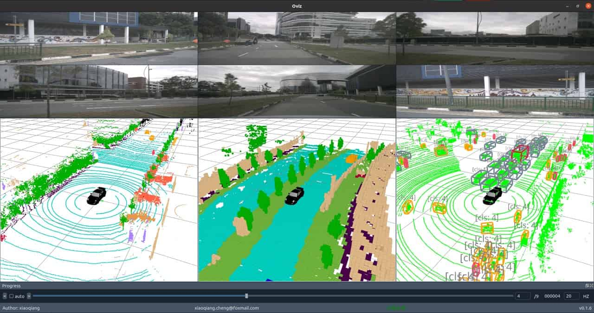
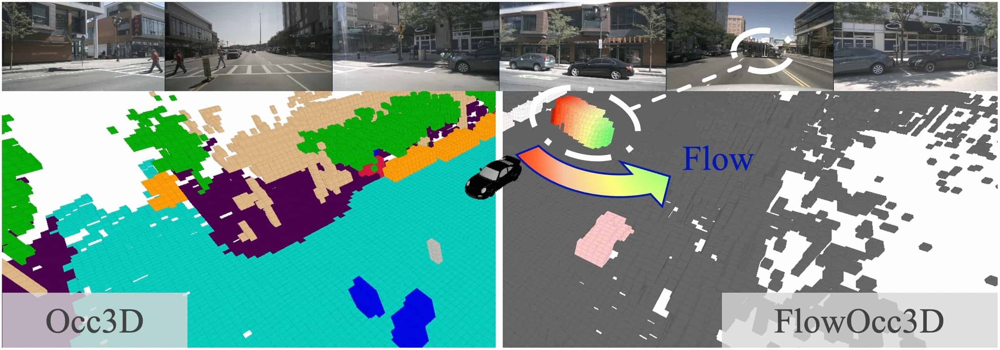
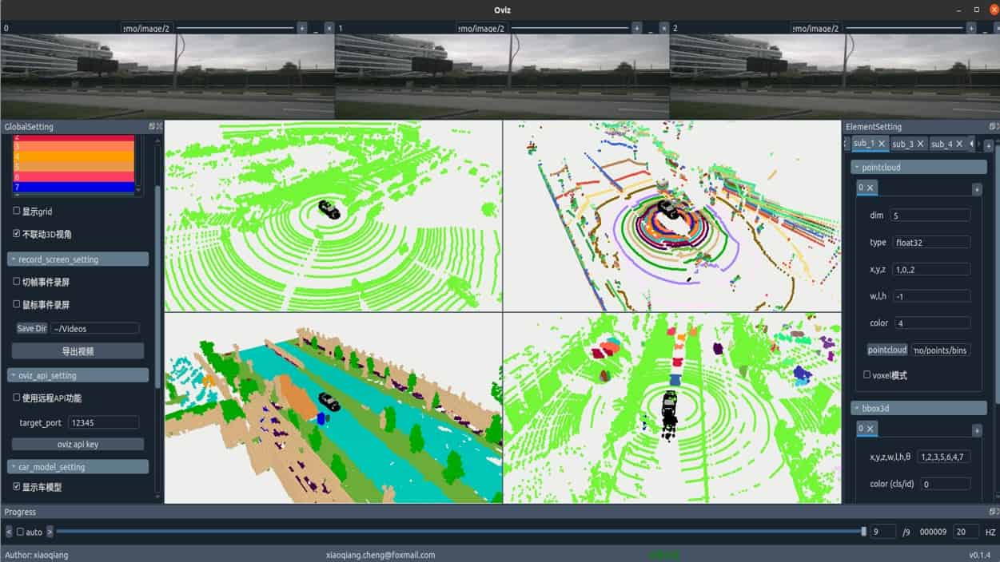
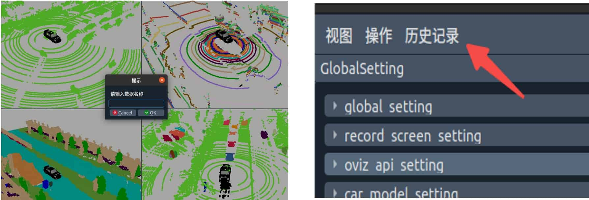
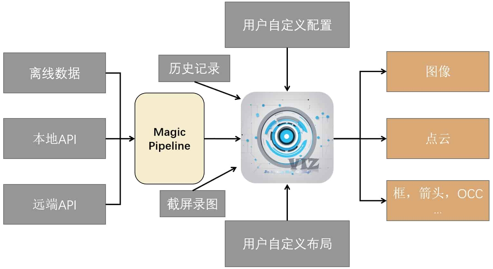

<div align="center">
  
  <div>&nbsp;</div>
  <div align="center">
    <b><font size="6">Xiaoqiang Studio</font></b>
    <sup>
      <a href="https://github.com/xiaoqiang-cheng">
        <i><font size="4">SUB1</font></i>
      </a>
    </sup>
    &nbsp;&nbsp;&nbsp;&nbsp;
    <b><font size="6">Oviz</font></b>
    <sup>
      <a href="https://github.com/xiaoqiang-cheng/Oviz">
        <i><font size="4">TRY IT OUT</font></i>
      </a>
    </sup>
  </div>
  <div>&nbsp;</div>
</div>

<div align="center">

[English](README.md) | 简体中文

</div>



---
## 介绍

一个正经的可视化工具，Xiaoqiang Studio三件套之一，Do Nothing, Show Anything。

专为计算机视觉任务设计的轻量级 Python 可视化工具，Oviz 简化了复杂的可视化操作，让你专注于数据本身，从繁重的可视化轮子中解脱出来。无论是 3D 点云展示，2D 图像渲染，还是复杂的车体模型显示，Oviz 都能轻松应对。

### 特性

- **跨平台兼容**：支持 Linux、Windows 和 macOS 平台。
- **简易安装**：提供 pypi 和源码两种安装方式。
- **快捷启动**：简单的一行命令即可开启 Oviz。
- **多任务支持**：支持点云、OCC、bbox 等 3D 元素和 2D 图像的可视化。
- **用户友好**：快捷键操作，自动录屏，历史记录功能一应俱全。
- **二次开发**：提供Oviz API和Magic Pipeline 两种方式快速扩展。

## 快速开始

### 安装&启动

oviz 支持在 Linux，Windows 和 macOS 上运行。它需要>=python3.7环境，建议使用conda 来管理python环境，以下操作默认在符合上述要求的python环境下执行。您可以使用pypi 源安装或源码安装两种方式。

(1) 安装

- pypi安装

```shell
pip install oviz
```

- 源码安装

```shell
git clone https://github.com/xiaoqiang-cheng/Oviz.git
cd Oviz/
pip install -v -e .
```

(2) 启动

```shell
oviz
```

如果一切顺利，你将会看到如下启动界面，由于作者是中国人，在开发中大部分界面信息使用了中文，将尽快适配全英文版本。


### 窗体介绍

- GlobalSetting
  - 全局设置窗，用于调整元素配色，设置录屏，显示车型等公共配置
- ElementSetting
  - 元素设置窗，用于选择离线数据，如点云、bbox等
- Progress
  - 用于切换上下帧
- Image
  - 图像显示窗，用于显示图像

以上为oviz的主要组件，通过菜单栏->视图 或者 快捷键操作，可以自由显示或隐藏。

### 显示3D元素

- 显示点云

  - 当前支持的点云文件格式有：.bin / .pcd /.txt
    - bin格式为二进制的点云格式，请保证其可以通过np.fromfile api解析成N * X 维的array，并在
    - pcd格式自带解析field，因此无需指定维度
    - txt点云，请保证txt中各个维度以空格或者逗号间隔，每个点一行
  - 首先，点击ElementSetting->template->pointcloud->[pointcloud] 按钮，选择要显示的点云文件夹
  - 据实填写 dim, xyz 维度,  wlh维度（可选，-1为不设置），color维度（将根据GlobalSetting中配色表显示颜色）
  - 点云将显示在中间的3D显示区

- 显示OCC

  - OCC显示设置与点云完全一致，请按照点云支持的文件和配置操作

  - OCC的wlh可以主动设置，如未配置，将 使用默认OCC格子大小(0.4m)

  - 可视化效果如下：

    

- 显示bbox

  - 当前只支持txt格式的bbox3d结果文件用于可视化
  - 首先，点击ElementSetting->template->bbox3d->[bbox3d] 按钮，选择要显示的bbox文件夹
  - 据实填写相关维度(xyzwlhθ)
  - 填写 旋转方向和相位差。
    - 这一栏中需要填写两个数字，第一个为顺/逆时针方向，第二个为相位差。默认方向定义为x轴起，逆时针旋转（此时为 1.0, 0)
    - 例如，当前坐标系下bbox3d方向定义为y轴起，顺时针方向，则方向为顺,相位差为0.5pi,当前栏填写为[-1, 0.5]

### 显示2D元素

- 显示图像
  - 如果图像窗体为隐藏状态，则应当首先显示图像窗体，即：菜单栏->视图->显示图片 或者通过快捷键(Ctrl+Shift+I)显示图像窗体
  - 通过双击图像窗体，选择要显示的离线图片文件夹，即可显示图像
  - 通过拖动图像标题栏可调整图像显示顺序和位置
  - 如果调整后多个图像窗体宽度未能保持一致，请按[r]即可自动对齐


### 显示车体

- 通过选中 [GlobalSetting->car_model_setting->显示车模型] 即可在3D视图中心显示仿真车
- 如果当前车头方向与数据坐标系方向不一致，请通过重新选中调整车头方向，每次选中车头方向调整 0.5pi

### 重置

当遇到非预期bug导致oviz无法正常操作使用时，你可以通过以下操作来重置工具

1. 首先，保证 oviz 处于关闭状态
2. 使用以下方式来删除用户配置

```shell
rm -r ~/.oviz
```

## 进阶使用

### 增加窗体

无论是3D组件还是2D组件，oviz都支持增加多组数据，你只要保证所有离线数据的文件名一致，即可方便用于对比可视化。例如 ECCV2024 [ViewFormer](https://arxiv.org/abs/2405.04299) 的 occ flow可视化就是基于此功能渲染。



- 图像窗体
  - 每个图像窗体的右上角都提供了 + 和 x两个按钮，可以方便的增删当前图像窗体。
- 3D视图
  - 在ElementSetting 窗口中，通过点击"template"最右侧的 + 可以轻松增加一组并列的3D视图，通过相同的选择数据操作，即可实现可视化对比
  - 对于同一组内的可视化元素（例如点云，bbox），你也可以直接增加，例如点击pointcloud最右侧 "+"，即可在当前3D视图内，新增一组点云。需要注意的时，在当前模式下，数据颜色将不由color维度控制，而是以堆叠的元素顺序显示颜色。

一个完整的多窗体示例如下图所示：


### 历史记录

当你配置好本地的离线数据后，如果想将保存当前配置和数据路径，以防将来修改时恢复，可以通过快捷键（Ctrl+S）保存，当需要恢复时点击 菜单栏->历史记录 即可恢复。



### 自动录屏

我们提供了两种录屏事件（切帧事件和鼠标事件），切帧事件会在你切换下一帧时保存下当前窗体渲染，鼠标事件则会在你操作鼠标（例如旋转3D视角）时，记录下窗体渲染。你只需要在 GlobalSetting->record_screen_setting 选中相应事件，然后播放数据即可。点击导出视频即可将刚才操作中记录下的所有图片导出为mp4。

保存的每一帧图片和视频将保存在 [Save Dir]配置的目录下。


### 快捷键

| 功能           | 快捷键         |
| -------------- | -------------- |
| 显示图片       | `Ctrl+Shift+I` |
| 显示3D窗口     | `Ctrl+Shift+C` |
| 显示日志       | `Ctrl+Shift+L` |
| 显示进度条     | `Ctrl+Shift+P` |
| 显示元素控制台 | `Ctrl+Shift+E` |
| 显示全局控制台 | `Ctrl+Shift+G` |
| 显示图片标题栏 | `Ctrl+Shift+T` |
| 显示状态栏     | `Ctrl+Shift+S` |
| 显示菜单栏     | `Ctrl+Shift+B` |
| 保存       | `Ctrl+S`   |
| 自动播放   | `Ctrl+P`   |
| 上一帧     | `Ctrl+L`   |
| 下一帧     | `Ctrl+N`   |

## 扩展功能

我们提供了两种方式方便用户扩展。oviz的整理架构如下图所示：



### Magic Pipeline

python的特性让我们可以实现很多像魔法一样的操作，因此，我把这个功能称为Magic Pipeline。具体来说，它是序列化数据到渲染界面之间的一个窗口。通过实现一个pipeline，我们可以实时修改或者打印一些信息，来帮助我们更快的debug。

你可以通过GlobalSetting->magic_pipeline_setting 来使能它。通过点击[打开编辑器] 将通过vscode (你必须已经装过) 打开一个示例的pipeline代码。你可以通过仿写这个函数来控制数据是否执行当前流程。

我尝试实现了一个装饰器来简化pipeline函数的设计，但是解释起来仍然很复杂。啊！所以，如果你会用到，请多自己尝试或者读代码吧。也可以与我联系，我可以远程和你交流这个功能。

以下为示例pipline写法。

```python
'''
note:
    1, if you need to add a new pipeline to repo, please add switch for it
    2, do not push you temporary pipe to repo
    3, add params instructions for your pipeline to easily apply
    4, all pipeline will be executed in sequence, so switch is very very important
    5, do not remember return data_dict
'''

import os
import numpy as np
from Oviz.MagicPipe.core import magic_pipeline_iterate

def magic_debug(self, key, data_dict, **kargs):
    '''
        print kargs when use magic pipeline
        {
            "magic_debug" : 1
        }
    '''
    if ("magic_debug" in kargs.keys()) and (kargs['magic_debug'] == 1):
        print(kargs)
    return data_dict


@magic_pipeline_iterate(element_keys=['bbox3d'], switch_key="fix_nus_bbox3d")
def fix_nus_bbox3d(self, key, group, ele, index, data, **kwargs):
    data = data.astype(np.float32)
    if len(data.shape) == 1:
        data = data.reshape(-1, data.shape[0])
    score_mask = data[:, -1] > 0.3
    data = data[score_mask]

    data[:, 3] = data[:, 3] + data[:, 6] / 2.0
    return data
```


### Oviz API

我们提供了一套API，可以使得你像opencv一样在你的代码种调用oviz可视化，当然，这是一个开发中的功能，目前只支持仅有的几种元素，未来可能会做一些重构优化，但是我仍然相信，这是一个非常值得期待的功能。

相比于本地可视化，远程服务器的可视化是更大的痛点。因此，我们基于TCP/IP 和 Share Memory 实现了两种中间件，用于远程和本地的api功能。


你可以用以下方式调用它：

- 本地API

```python
from Oviz import Oviz
import numpy as np

for i in range(10):
  Oviz.imshow("image/0/%s.jpg"%(str(i).zfill(6)))
  Oviz.imshow("image/1/%s.jpg"%(str(i).zfill(6)))

  fake_img = np.ones((720, 720, 3), dtype=np.uint8) * i * 10

  Oviz.imshow(fake_img)
  Oviz.pcshow("points/bins/%s.bin"%(str(i).zfill(6)))
  print(i)
  Oviz.waitKey()
```


- 远程API

```python
from Oviz import Oviz
import numpy as np

Oviz.init_oviz_api("192.168.18.106")

for i in range(10):
    Oviz.imshow("image/0/%s.jpg"%(str(i).zfill(6)))
    Oviz.imshow("image/1/%s.jpg"%(str(i).zfill(6)))

    fake_img = np.ones((720, 720, 3), dtype=np.uint8) * i * 10

    Oviz.imshow(fake_img)
    Oviz.pcshow("points/bins/%s.bin"%(str(i).zfill(6)))
    print(i)
    Oviz.waitKey()
```

经过我们的抽象，远程api相比本地只是多了局域网下的IP和端口初始化，其他完全一样。使用远程API时，你需要在oviz窗体 GloabalSetting->oviz_api_setting 打开该功能。

## 未来计划

- [ ] 显示2D BBox
- [ ] 显示2D 分割
- [ ] 显示车道线
- [ ] 显示3D->2D投影
- [ ] 提高操作的便携性
- [ ] etc...

如果你遇到问题或者需求，[欢迎点击issue提问](https://github.com/xiaoqiang-cheng/Oviz/issues)，将尽快修复。也可以直接邮件给我  xiaoqiang.cheng@foxmail.com。

当然，欢迎你主动修改或增加功能，提交代码与我共创。

## Starchart

[](https://star-history.com/#xiaoqiang-cheng/Oviz&Date)

## Contributors

<a href="https://github.com/xiaoqiang-cheng/Oviz/graphs/contributors">
  
</a>